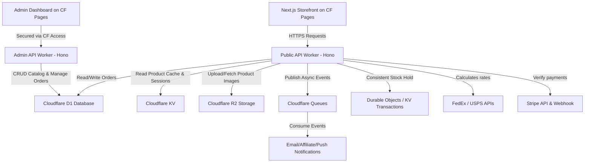

# Headless E-Commerce on Cloudflare Workers - Architecture Brief

Bản phân tích thiết kế kiến trúc kỹ thuật (Architecture Brief) cho hệ thống E-commerce Headless, sử dụng hệ sinh thái Cloudflare Workers làm nền tảng Edge Serverless.

## Inputs
- **feature-ticket.json (yes/no):** Yes (Tiêu thụ [feature-ticket-ecommerce-mvp.json](file:///home/user/personalized/e-commerce/plan/feature-ticket-ecommerce-mvp.json)).
- **research-report.json (yes/no):** No.

## Context
- **Problem:** Xây dựng hệ thống E-commerce headless hiệu năng cao, chi phí thấp, tối ưu hóa độ trễ biên (Edge latency) cho thị trường toàn cầu. Hệ thống cần xử lý kiểm kho chính xác (real-time stock) và tích hợp các API bên thứ 3 (Stripe, FedEx, USPS) trong môi trường Serverless runtime (V8 isolates).
- **Constraints:** 
  - Chạy hoàn toàn trên Cloudflare Workers (không chạy server Node.js truyền thống).
  - Giới hạn thời gian thực thi (CPU execution time limit) và dung lượng bundle của Workers.
  - Đảm bảo tính nhất quán dữ liệu tồn kho (strong consistency) tại Edge để tránh overselling (bán quá số lượng tồn kho thực tế).
- **Preserved behavior:** Giữ nguyên các trạng thái đơn hàng nghiệp vụ chuẩn của WooCommerce.

---

## System Boundaries & Affected Services

Hệ thống phân tách thành 2 vùng chính:



### 1. Affected Services & Core Components
- **`storefront-ui`**: Front-end mua sắm (Next.js/Remix) triển khai trên Cloudflare Pages.
- **`admin-ui`**: Front-end quản trị nội bộ (SPA Vite/React dùng Refine.dev) deploy lên Cloudflare Pages riêng biệt (ví dụ: `admin.domain.com`).
- **`public-api-worker`**: Back-end API phục vụ khách hàng (Catalog, Cart, Checkout, Webhook). 
- **`admin-api-worker`**: Back-end API phục vụ quản trị (CRUD sản phẩm, hoàn tiền, báo cáo). Được tách riêng khỏi Public Worker để giảm bundle size.
- Cả hai Worker đều chọc chung vào: **Cloudflare D1 (Database)**, **R2 (Storage)**, và **Queues (Async Events)**.
- **`shipping-integration`** & **`payment-integration`**: Các module tích hợp ngoại vi.

### 2. Kiến trúc Kho mã nguồn (Repository Architecture)
Hệ thống sử dụng **Monorepo Architecture** (quản lý bởi `pnpm workspaces` và `Turborepo`) để chứa toàn bộ vòng đời của hệ thống.
- Các ứng dụng chạy độc lập (Workers, Next.js) nằm trong thư mục `apps/`.
- Các mô-đun chia sẻ (D1 Schema, Kysely/Drizzle ORM, Zod Types, Hono RPC Contracts) nằm trong thư mục `packages/`.
**Lợi ích cốt lõi:** Frontend Next.js (Storefront) và React (Admin UI) có thể trực tiếp import End-to-End Typescript Interface từ Hono Worker (cơ chế Hono RPC) mà không cần build trung gian. Đảm bảo Type-safety tuyệt đối từ Database lên đến UI.

### 3. API Contract References
- `api-contract-spec.json`: Sẽ được Backend Developer định nghĩa bám sát spec thiết kế API endpoints cho Catalog, Cart, Checkout và Orders, đặt trong `packages/contract`.

---

## Options Considered

### Option A: Monolithic Worker sử dụng Cloudflare D1 & KV
- **Chi tiết:** Toàn bộ API (Catalog, Cart, Checkout, Order) nằm trong một Worker duy nhất sử dụng Hono Router. Dữ liệu Catalog & Orders lưu ở Cloudflare D1 (SQLite phân tán). Tồn kho và session lưu tạm ở Cloudflare KV.
- **Pros:**
  - Triển khai và quản lý đơn giản (1 worker project, 1 config wrangler).
  - Không tốn chi phí gọi chéo giữa các workers.
  - Dễ kiểm thử và viết unit tests local bằng Miniflare.
- **Cons:**
  - Cloudflare KV chỉ đạt tính nhất quán cuối cùng (eventual consistency), có nguy cơ tranh chấp tồn kho khi có lượng truy cập đồng thời lớn (race condition khi trừ kho).
  - Bundle size có thể lớn khi tích hợp nhiều SDK (Stripe, FedEx).

### Option B: Decoupled Workers kết hợp Durable Objects (Khuyên dùng cho E-commerce)
- **Chi tiết:** Tách biệt thành các micro-workers: `catalog-worker`, `cart-checkout-worker`, `order-worker`. Sử dụng **Durable Objects (DO)** để quản lý trạng thái tồn kho thời gian thực (Real-time Inventory) nhằm đảm bảo tính nhất quán tuyệt đối (Strong Consistency) và chống overselling tại Edge.
- **Pros:**
  - Đảm bảo tính chính xác 100% của tồn kho nhờ Durable Objects hoạt động theo cơ chế Single-thread In-memory cho từng Product ID.
  - Phân tách code rõ ràng, dễ bảo trì, bundle size nhỏ cho từng worker.
- **Cons:**
  - Chi phí vận hành cao hơn (Durable Objects yêu cầu gói Cloudflare Paid Plan).
  - Kiến trúc giao tiếp phức tạp hơn giữa các Workers thông qua Service Bindings.

---

## Recommendation & Decisions

### Decision: **Option A (Hỗn hợp cải tiến cho MVP)**
Để tối ưu chi phí và tốc độ phát triển cho bản MVP, quyết định chọn thiết kế **Monolithic Worker sử dụng Hono + Cloudflare D1 + D1 Transactions (hoặc KV với cơ chế Optimistic Locking)**. 

#### Giải pháp xử lý các bài toán kỹ thuật cụ thể:
1. **Kiểm soát tồn kho (Race Condition):**
   - Không lưu số lượng tồn kho động ở KV. Sử dụng Cloudflare D1 (SQLite) để quản lý bảng `products` và `product_variations`.
   - Thực hiện trừ kho thông qua **D1 Database Transactions** (`BEGIN TRANSACTION ... COMMIT`) sử dụng truy vấn SQL có điều kiện: `UPDATE product_variations SET stock = stock - ? WHERE id = ? AND stock >= ?`. Điều này đảm bảo tính nguyên tử (Atomicity) ở mức database.
2. **Tích hợp FedEx / USPS (Shipping):**
   - Viết module HTTP client trực tiếp trong worker để giao tiếp với REST API của FedEx/USPS. Sử dụng Cloudflare KV để cache phí ship tạm thời theo `Zipcode + Trọng lượng tổng` trong vòng 10 phút nhằm giảm số lượng API call tốn phí.
3. **Thanh toán Stripe:**
   - Sử dụng thư viện `stripe` tương thích với Workers runtime (`import Stripe from 'stripe'`).
   - Xử lý xác thực chữ ký Webhook (`stripe.webhooks.constructEvent`) sử dụng Web Crypto API có sẵn trên Workers.
4. **Hủy đơn hàng tự động (Stripe Timeout):**
   - Sử dụng **Cloudflare Workers Cron Triggers** chạy mỗi 5 phút để quét bảng `orders` tìm các đơn hàng `Pending_Payment` đã quá 30 phút, cập nhật trạng thái thành `Cancelled` và hoàn lại tồn kho trong D1.
5. **Kiến trúc Admin Dashboard (Internal Back-office):**
   - Đội DevOps đã cảnh báo giới hạn Bundle Size 1MB. Do đó, Architect quyết định **Tách Admin API thành một Worker Project riêng (`admin-api-worker`)**. Cả Public Worker và Admin Worker sẽ bind chung vào một D1 Database và R2 Bucket.
   - **Bảo mật Cấp Mạng (Network-level Security):** Không chỉ dựa vào JWT nội bộ. Domain của Admin UI và Admin API sẽ được bảo vệ bởi **Cloudflare Access (Zero Trust)**. Bất kỳ request nào muốn chạm vào hệ thống Admin đều phải được Cloudflare CDN chặn lại và yêu cầu đăng nhập bằng Google Workspace / GitHub SSO của công ty. Điều này loại bỏ hoàn toàn bề mặt tấn công API.

---

## Migration & Rollback Plan

### 1. Migration Plan
- **Database Schema:** Tạo các câu lệnh migration D1 cho cấu trúc bảng: `customers`, `products`, `product_variations`, `orders`, `order_items`.
- **Deployment:** Triển khai API worker lên môi trường staging sử dụng Wrangler. Sử dụng Wrangler environments (`wrangler deploy --env staging`).

### 2. Rollback Plan
- Do đây là hệ thống MVP xây dựng mới hoàn toàn, rollback plan chỉ cần hỗ trợ rollback phiên bản Worker API thông qua lệnh: `wrangler rollback` để đưa API về phiên bản hoạt động ổn định gần nhất nếu phát hiện lỗi nghiêm trọng sau khi deploy.

---

## Mobile & Native App Integration (Tích hợp Ứng dụng Di động & Native)

Khi mở rộng hệ thống headless từ Web Storefront sang các ứng dụng di động (Mobile App viết bằng React Native, Flutter, Swift, hoặc Kotlin), việc sử dụng Hono.js trên Cloudflare Workers mang lại nhiều lợi thế nhưng cũng đi kèm các thách thức kiến trúc cần giải quyết:

```mermaid
graph TD
    subgraph Mobile Clients
        RNApp[React Native TypeScript]
        FlutterApp[Flutter / Swift / Kotlin]
    end

    subgraph Edge Layer (Cloudflare)
        WAF[Cloudflare API Shield / WAF]
        HonoAPI[Hono API Worker]
        D1[(Cloudflare D1)]
    end

    RNApp -->|Hono RPC Client| WAF
    FlutterApp -->|OpenAPI Generated SDK| WAF
    WAF -->|Validate & Route| HonoAPI
    HonoAPI -->|Query / Transact| D1
```

### 1. Cơ chế giao tiếp API (API Protocols)
- **React Native / Expo (TypeScript):** Có thể tận dụng trực tiếp tính năng **Hono RPC**. Bằng cách import Type định dạng API từ Backend Worker sang Mobile frontend, client có thể gọi API thông qua `hc<AppType>()` tương tự như gọi hàm nội bộ, đảm bảo **Type-Safety** tuyệt đối từ database đến giao diện mà không cần build code-gen.
- **Flutter / Swift / Kotlin:** Không thể sử dụng trực tiếp Hono RPC vì khác biệt ngôn ngữ.
  - **Giải pháp:** Sử dụng thư viện `@hono/zod-openapi` để tự động tạo ra file tài liệu chuẩn OpenAPI (Swagger JSON/YAML). 
  - Sử dụng **OpenAPI Generator** để tự động sinh SDK Client tương ứng cho Dart (Flutter), Swift (iOS), hoặc Kotlin (Android) trong quá trình CI/CD. Điều này giúp loại bỏ sai số giữa Frontend và Backend API contract.

### 2. Xác thực và Bảo mật tại Edge (Edge Authentication & Security)
- **Phương thức xác thực:** Trái ngược với Web thường sử dụng HttpOnly Cookie (để chống tấn công XSS), Mobile App quản lý session tốt hơn trong môi trường sandbox của hệ điều hành. Do đó, kiến trúc chuyển sang sử dụng **Bearer Token (JWT)** được gửi qua header `Authorization`.
  - Hono sử dụng `hono/jwt` middleware để xác thực token ngay tại biên (Edge) bằng Web Crypto API tích hợp sẵn trên Cloudflare Workers. Thời gian xác thực siêu nhanh (< 2ms) mà không cần truy vấn Database D1.
  - Mobile client lưu trữ JWT an toàn bằng cách sử dụng Secure Store (iOS Keychain / Android EncryptedSharedPreferences).
- **API Abuse Prevention (Chống lạm dụng API):** Mobile App dễ bị dịch ngược để lấy API endpoint.
  - Tích hợp **Cloudflare API Shield** để triển khai các lớp phòng vệ như: mTLS (mutual TLS - nếu cần bảo mật mức tối đa), JWT validation ở mức CDN, và Rate Limiting theo địa chỉ IP kết hợp Device Fingerprint để tránh tình trạng bot cào dữ liệu Catalog hoặc spam đặt đơn hàng giả.

### 3. Đồng bộ hóa Giỏ hàng & Xử lý Ngoại tuyến (Cart Synchronization & Offline-first)
- Thiết bị di động thường hoạt động trong môi trường mạng không ổn định (3G/4G chập chờn).
- **Kiến trúc Giỏ hàng (Cart):**
  - Giỏ hàng sẽ được lưu cục bộ (Local Cart) bằng công nghệ database SQLite trên máy (ví dụ: WatermelonDB cho React Native, Hive/Isar cho Flutter).
  - API Hono sẽ cung cấp một endpoint **Sync Cart** (`POST /cart/sync`). Endpoint này nhận danh sách sản phẩm hiện tại của giỏ hàng offline, đối chiếu tồn kho thực tế trong D1, và trả về trạng thái giỏ hàng mới nhất đồng thời tính toán phí ship/thuế tạm tính. Điều này giúp giảm thiểu API Call liên tục khi người dùng đang mua sắm.

### 4. Push Notification (Thông báo đẩy)
- Các tác vụ như cập nhật đơn hàng thành công, giao hàng thành công cần được gửi tới ứng dụng thông qua dịch vụ thông báo đẩy (FCM cho Android và APNs cho iOS).
- **Thiết kế:**
  - Hono API ghi nhận `device_token` của người dùng khi đăng nhập app và lưu vào bảng `user_devices` ở D1.
  - Khi Stripe Webhook xác nhận thanh toán thành công hoặc đối tác giao nhận cập nhật trạng thái đơn hàng: Hono Worker sẽ kích hoạt một tiến trình nền (thông qua `c.executionCtx.waitUntil`) gửi POST Request trực tiếp tới API Firebase Cloud Messaging để đẩy thông báo tới thiết bị của người dùng, giúp giao diện Mobile cập nhật trạng thái đơn hàng ngay lập tức.

---

## Open Questions (Cần thảo luận thêm với Tech Lead)
1. **Durable Objects:** Trong tương lai nếu lượng traffic flash-sale tăng mạnh, hệ thống có sẵn sàng trả phí nâng cấp lên Durable Objects để tối ưu khóa tồn kho in-memory không?
2. **Cơ chế Cache:** Có cần thiết sử dụng Cloudflare Cache API cho các public endpoint như `/products` để tối ưu hóa tốc độ tải trang Catalog?
3. **OpenAPI Schema Distribution:** Chúng ta sẽ phân phối file OpenAPI JSON tự động sinh từ Hono bằng cách nào sang repository của Mobile App? (Có nên dùng một repo trung gian chứa schema hay tự động trigger CI/CD sinh SDK mỗi khi main branch của API thay đổi?)

---
*Documented by: Technical Architect Agent (theo role agent-skills)*

