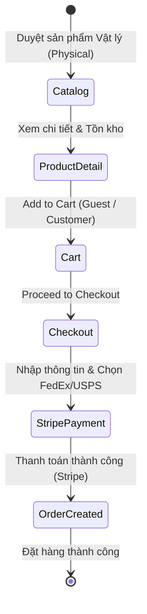
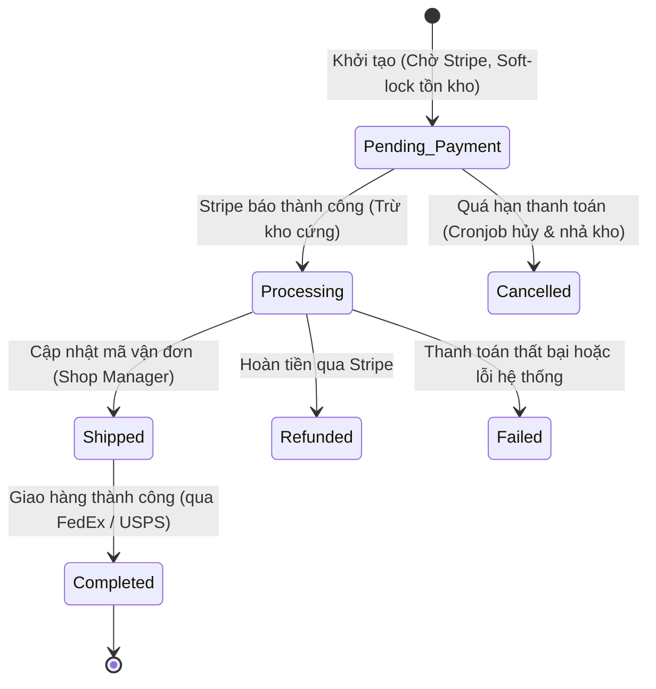

# E-Commerce Core Flow (WooCommerce Model) - Business Analysis Brief

Bản phân tích yêu cầu nghiệp vụ (Business Analysis Brief) cho hệ thống E-commerce cốt lõi, được điều chỉnh dựa trên các lựa chọn kỹ thuật và phạm vi từ người dùng.

## Business Context
- **Problem:** Xây dựng hệ thống E-commerce tinh gọn có luồng nghiệp vụ chuẩn tương tự WooCommerce, tối ưu hóa để chạy trên kiến trúc Serverless (Cloudflare Workers) với hiệu năng cao.
- **Users or actors:**
  - **Guest:** Khách vãng lai, lướt xem sản phẩm, thêm vào giỏ và checkout không bắt buộc tạo tài khoản.
  - **Customer:** Khách hàng đăng ký tài khoản, quản lý địa chỉ giao hàng và xem lịch sử đơn hàng.
  - **Shop Manager:** Quản lý cửa hàng, xử lý đơn hàng, theo dõi tồn kho và các tích hợp vận chuyển.
  - **Administrator:** Quản trị viên hệ thống.
- **Outcome:** Bộ yêu cầu nghiệp vụ hoàn chỉnh làm đầu vào để Technical Lead/Architect thiết kế kiến trúc phân tán (Cloudflare Workers, KV, D1/Hyperdrive) và UI/UX Designer dựng giao diện.
- **Preserved behavior:** Giữ nguyên quy trình xử lý trạng thái đơn hàng của WooCommerce (Pending Payment -> Processing -> Completed).
- **Changed behavior:** Thay đổi cấu trúc tích hợp từ monolithic sang Headless (Decoupled Front-end & Back-end) chạy trên Cloudflare Workers.

---

## Process Flow (Luồng nghiệp vụ mục tiêu)

### 1. Luồng mua hàng (Shopping Flow)

### 2. Vòng đời đơn hàng (Order State Machine)

---

## Requirements

### 1. Product Catalog & Management
- **Scope:** Chỉ hỗ trợ **Sản phẩm Vật lý (Physical Goods)**. Không hỗ trợ sản phẩm ảo (Virtual) hay tải xuống (Downloadable) trong MVP.
- **Functional requirements:**
  - Quản lý Simple Product và Variable Product (Size, Color).
  - Quản lý Categories, Tags, Attributes.
  - Track tồn kho theo thời gian thực (Real-time Inventory) tương thích với Cloudflare Workers KV/D1.
- **Business rules:**
  - Sản phẩm hết hàng (Out of stock) sẽ hiển thị trạng thái và không cho phép thêm vào giỏ.

### 2. Cart & Checkout (Guest Allowed)
- **Functional requirements:**
  - Giỏ hàng lưu trữ ở phía client (Local Storage / Session) và đồng bộ qua API.
  - **Guest Checkout:** Cho phép mua hàng mà không cần tài khoản. Người mua chỉ cần cung cấp Email & Số điện thoại để nhận thông báo đơn hàng.
  - Sổ địa chỉ hỗ trợ hai địa chỉ riêng biệt: Billing Address và Shipping Address.
- **Business rules:**
  - Khách hàng vãng lai có thể tùy chọn click "Create an account" tại bước checkout để tự động tạo tài khoản dựa trên Email đã nhập.

### 3. Tích hợp Vận chuyển (Shipping Integration - FedEx / USPS)
- **Functional requirements:**
  - Hỗ trợ biểu phí cố định (Flat Rate) làm mặc định để tính tổng tiền ngay ở giỏ hàng.
  - Tích hợp API FedEx và USPS để tính phí vận chuyển theo thời gian thực dựa trên địa chỉ nhận hàng (Zipcode).
- **Business rules:**
  - **Chưa nhập địa chỉ:** Áp dụng phí vận chuyển cố định (**Flat Rate**).
  - **Đã nhập địa chỉ:** Kiểm tra cấu hình API Key của FedEx/USPS. Nếu có, lấy phí vận chuyển theo thời gian thực (lưu cache KV 10 phút). Nếu không có (hoặc gọi API lỗi), tự động fallback về **Flat Rate**.

### 4. Tích hợp Thanh toán & Hoàn tiền (Payment & Refund - Stripe)
- **Functional requirements:**
  - Tích hợp **Stripe Checkout Session** để xử lý thanh toán online, tự động tính Thuế (Stripe Tax) và Khuyến mãi (Stripe Coupons).
  - Đồng bộ trạng thái đơn hàng thông qua Stripe Webhook, xử lý an toàn chống trùng lặp (Idempotency).
  - Xử lý API Hoàn tiền (Refund API) để đổi trạng thái đơn hàng sang `Refunded`.
- **Business rules:**
  - **Tồn kho (Soft-lock):** Khi tạo Checkout Session, hệ thống giữ chỗ tồn kho (Soft-lock) trong 30 phút ở bảng `inventory_reservations`. Nếu quá hạn chưa thanh toán, Cronjob 5 phút/lần sẽ tự động hủy đơn và hoàn tồn kho.
  - **Trừ kho cứng:** Đơn hàng chỉ chuyển sang trạng thái `Processing` và trừ tồn kho chính thức khi Stripe Webhook xác nhận thanh toán thành công (`checkout.session.completed`).
  - **Thuế & Khuyến mãi:** Giao phó hoàn toàn việc tính toán Thuế tự động và Khuyến mãi cho nền tảng Stripe xử lý trong Checkout Session. Dữ liệu sẽ được trích xuất từ webhook metadata để lưu vào hệ thống.
  - **Quy trình Hoàn tiền (Refund):** Khi Admin/Shop Manager kích hoạt hoàn tiền trên Dashboard, hệ thống gọi API Stripe Refund, hoàn lại (+1) số lượng tồn kho trên D1.

### 5. Affiliate & Marketing Analytics
- **Functional requirements:**
  - Hệ thống phải nhận diện được các tham số theo dõi (UTM params, `affiliate_id`) từ URL khi khách (Guest hoặc Customer) truy cập.
- **Business rules:**
  - Các tham số Affiliate này phải được lưu vào Session giỏ hàng.
  - Khi thanh toán, tham số Tracking bắt buộc phải được truyền vào **Stripe Metadata** để phục vụ bộ phận Kế toán (Finance) đối soát hoa hồng trên Dashboard của Stripe.

### 6. Transactional Emails (Thông báo giao dịch)
- **Functional requirements:**
  - Gửi email tự động không đồng bộ thông qua Cloudflare Queues để không làm chậm webhook thanh toán.
- **Business rules:**
  - Các sự kiện gửi email: Xác nhận đơn hàng (Khi sang `Processing`), Gửi hàng (Khi sang `Shipped`), Hoàn tiền (`Refunded`).
  - Giai đoạn MVP sử dụng Mock Email ghi log ra console; sau đó tích hợp Resend API.

### 7. Kiến trúc kỹ thuật (Headless Cloudflare Workers)
- **Functional requirements:**
  - Phân tách hoàn toàn Front-end (Next.js/Vite) và Back-end API (Cloudflare Workers).
  - Lưu trữ dữ liệu tối ưu hóa cho Edge (D1 SQL Database, KV, R2, Queues cho tác vụ ngầm).

---

## Acceptance Criteria (Ví dụ: Thanh toán qua Stripe & Tạo đơn)
- **Given** người dùng ở trang Checkout và chưa nhập địa chỉ.
- **Then** hệ thống tính phí vận chuyển theo mức Flat Rate.
- **When** người dùng nhập địa chỉ và tiến hành thanh toán qua Stripe Checkout.
- **Then** hệ thống tạo bản ghi giữ chỗ tồn kho (Soft-lock) trong 30 phút.
- **And** hệ thống hiển thị trang Stripe với số tiền đã cộng đủ Thuế tự động (Stripe Tax).
- **When** thanh toán thành công, Stripe gửi webhook.
- **Then** hệ thống chuyển trạng thái đơn hàng thành `Processing`.
- **And** trừ tồn kho chính thức (Hard-lock) và xóa bản ghi Soft-lock.
- **And** đẩy thông báo vào Queue để gửi email (Mock) xác nhận đơn hàng cho khách.
- **And** giỏ hàng được xóa sạch.

---

*Documented by: Business Analyst Agent (theo role agent-skills)*
