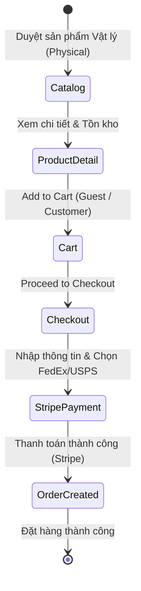
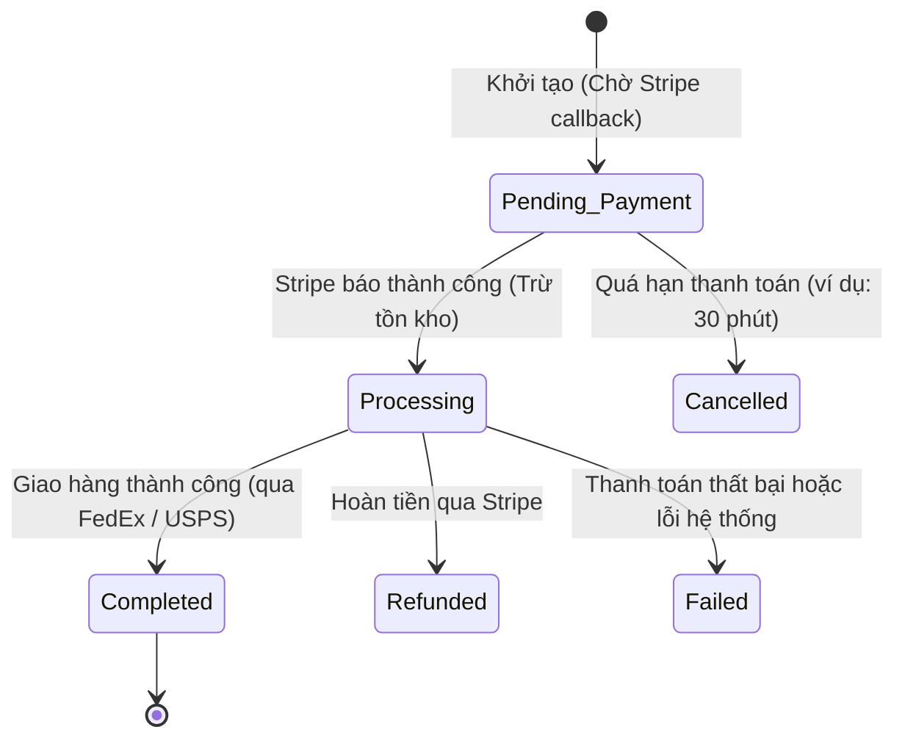

# E-Commerce Core Flow (WooCommerce Model) - Business Analysis Brief

Bản phân tích yêu cầu nghiệp vụ (Business Analysis Brief) cho hệ thống E-commerce cốt lõi, được điều chỉnh dựa trên các lựa chọn kỹ thuật và phạm vi từ người dùng.

## Business Context
- **Problem:** Xây dựng hệ thống E-commerce tinh gọn có luồng nghiệp vụ chuẩn tương tự WooCommerce, tối ưu hóa để chạy trên kiến trúc Serverless (Cloudflare Workers) với hiệu năng cao.
- **Users or actors:**
  - **Guest:** Khách vãng lai, lướt xem sản phẩm, thêm vào giỏ và checkout không bắt buộc tạo tài khoản.
  - **Customer:** Khách hàng đăng ký tài khoản, quản lý địa chỉ giao hàng và xem lịch sử đơn hàng.
  - **Shop Manager:** Quản lý cửa hàng, xử lý đơn hàng, theo dõi tồn kho và các tích hợp vận chuyển.
  - **Administrator:** Quản trị viên hệ thống.
- **Outcome:** Bộ yêu cầu nghiệp vụ hoàn chỉnh làm đầu vào để Technical Lead/Architect thiết kế kiến trúc phân tán (Cloudflare Workers, KV, D1/Hyperdrive) và UI/UX Designer dựng giao diện.
- **Preserved behavior:** Giữ nguyên quy trình xử lý trạng thái đơn hàng của WooCommerce (Pending Payment -> Processing -> Completed).
- **Changed behavior:** Thay đổi cấu trúc tích hợp từ monolithic sang Headless (Decoupled Front-end & Back-end) chạy trên Cloudflare Workers.

---

## Process Flow (Luồng nghiệp vụ mục tiêu)

### 1. Luồng mua hàng (Shopping Flow)

### 2. Vòng đời đơn hàng (Order State Machine)

---

## Requirements

### 1. Product Catalog & Management
- **Scope:** Chỉ hỗ trợ **Sản phẩm Vật lý (Physical Goods)**. Không hỗ trợ sản phẩm ảo (Virtual) hay tải xuống (Downloadable) trong MVP.
- **Functional requirements:**
  - Quản lý Simple Product và Variable Product (Size, Color).
  - Quản lý Categories, Tags, Attributes.
  - Track tồn kho theo thời gian thực (Real-time Inventory) tương thích với Cloudflare Workers KV/D1.
- **Business rules:**
  - Sản phẩm hết hàng (Out of stock) sẽ hiển thị trạng thái và không cho phép thêm vào giỏ.

### 2. Cart & Checkout (Guest Allowed)
- **Functional requirements:**
  - Giỏ hàng lưu trữ ở phía client (Local Storage / Session) và đồng bộ qua API.
  - **Guest Checkout:** Cho phép mua hàng mà không cần tài khoản. Người mua chỉ cần cung cấp Email & Số điện thoại để nhận thông báo đơn hàng.
  - Sổ địa chỉ hỗ trợ hai địa chỉ riêng biệt: Billing Address và Shipping Address.
- **Business rules:**
  - Khách hàng vãng lai có thể tùy chọn click "Create an account" tại bước checkout để tự động tạo tài khoản dựa trên Email đã nhập.

### 3. Tích hợp Vận chuyển (Shipping Integration - FedEx / USPS)
- **Functional requirements:**
  - Tích hợp API FedEx và USPS để tính phí vận chuyển theo thời gian thực (Real-time shipping rates) dựa trên kích thước, khối lượng sản phẩm và địa chỉ nhận hàng (Zipcode).
  - Hiển thị danh sách phương thức vận chuyển và phí tương ứng tại trang checkout.
- **Business rules:**
  - Phí vận chuyển được tính động từ API bên thứ ba và cộng trực tiếp vào Tổng tiền đơn hàng trước khi thanh toán.

### 4. Tích hợp Thanh toán & Hoàn tiền (Payment & Refund - Stripe)
- **Functional requirements:**
  - Tích hợp **Stripe** (Stripe Elements / Checkout Session) để xử lý thanh toán online bảo mật.
  - Đồng bộ trạng thái đơn hàng thông qua Stripe Webhook.
  - Xử lý API Hoàn tiền (Refund API) để đổi trạng thái đơn hàng sang `Refunded`.
- **Business rules:**
  - Đơn hàng chỉ chuyển sang trạng thái `Processing` sau khi Stripe Webhook xác nhận thanh toán thành công (`payment_intent.succeeded`).
  - Tồn kho của sản phẩm chỉ được trừ chính thức khi webhook báo thành công để tránh giữ chỗ ảo quá lâu (Hold stock tối đa 30 phút ở trạng thái Pending Payment).
  - Quy trình Hoàn tiền (Refund): Khi Admin/Shop Manager kích hoạt hoàn tiền trên Dashboard, hệ thống phải gọi API Stripe Refund, đồng thời hoàn lại (+1) số lượng tồn kho trên D1.

### 5. Affiliate & Marketing Analytics
- **Functional requirements:**
  - Hệ thống phải nhận diện được các tham số theo dõi (UTM params, `affiliate_id`) từ URL khi khách (Guest hoặc Customer) truy cập.
- **Business rules:**
  - Các tham số Affiliate này phải được lưu vào Session giỏ hàng.
  - Khi thanh toán, tham số Tracking bắt buộc phải được truyền vào **Stripe Metadata** để phục vụ bộ phận Kế toán (Finance) đối soát hoa hồng trên Dashboard của Stripe mà không cần chắp vá dữ liệu thủ công.

### 6. Kiến trúc kỹ thuật (Headless Cloudflare Workers)
- **Functional requirements:**
  - Phân tách hoàn toàn Front-end (ví dụ: Next.js/Vite deploy trên Cloudflare Pages) và Back-end API (chạy trên Cloudflare Workers).
  - Lưu trữ dữ liệu tối ưu hóa cho Edge (D1 SQL Database, KV, R2 cho hình ảnh, Queues cho tác vụ ngầm).

---

## Acceptance Criteria (Ví dụ: Thanh toán qua Stripe & Tạo đơn)
- **Given** người dùng (Guest/Customer) đã chọn phương thức vận chuyển FedEx/USPS và nhập địa chỉ hợp lệ.
- **When** người dùng thực hiện thanh toán thành công qua Stripe.
- **Then** Stripe Webhook gửi callback về API Cloudflare Workers.
- **And** hệ thống chuyển trạng thái đơn hàng thành `Processing`.
- **And** số lượng tồn kho của các sản phẩm tương ứng giảm đi.
- **And** gửi email thông báo đơn hàng kèm mã vận đơn dự kiến cho khách hàng.
- **And** giỏ hàng được xóa sạch.

---

## Open Questions (Đã xác nhận)
1. **Payment Methods:** Stripe (Đã xác nhận).
2. **Shipping Rules:** Tích hợp FedEx & USPS (Đã xác nhận).
3. **Guest Checkout:** Cho phép (Đã xác nhận).
4. **Sản phẩm:** Chỉ sản phẩm vật lý - Physical (Đã xác nhận).
5. **Giao diện/Front-end:** Headless dựa trên mô hình Cloudflare Workers (Đã xác nhận).

---
*Documented by: Business Analyst Agent (theo role agent-skills)*
